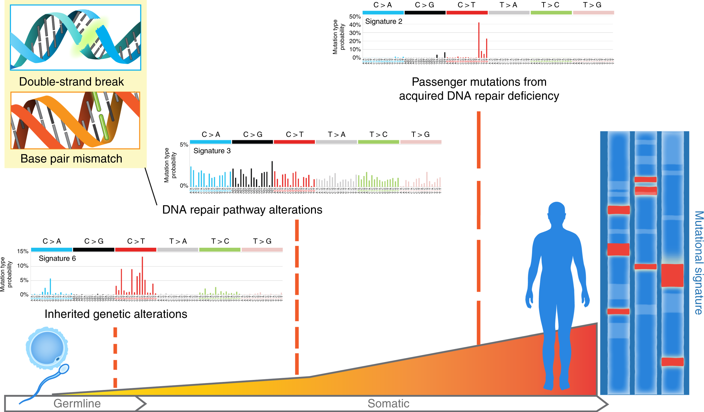

# (PART\*) Part I: Background and Prerequisite {-}

# Introduction {#intro}

## Mutational signatures

Underlying cancer hallmarks are genome instability, which generates the genetic diversity that expedites their acquisition, and inflammation, which fosters multiple hallmark functions [@hanahanHallmarksCancerNext2011]. Cancer genomes typically harbors more than 1,000 mutations in small (e.g., point mutations, short insertions and deletions) and large scale (e.g., copy number variations, rearrangements). Genomic contexts where mutation may accumulate in response to both endogenous processes and exogeneous exposures. In recent years, computational approaches (typically non-negative matrix factorization (NMF)) have been applied to the mutation catalog analysis of human/mouse tumors to detect characteristic mutational patterns, also known as **"mutational signatures"**.


### Biological significance of mutational signature

To better illustrate the biological significance of mutational signatures, we show some
well organized figures here.

```{r echo=FALSE, fig.cap="The illustration of SBS signature, fig source: https://www.nature.com/articles/nrg3729", out.width="80%", fig.width=10}
knitr::include_graphics("fig/sbs_signature_overview_nat_review2.png")
```

```{r echo=FALSE, fig.cap="The illustration of SBS signature (2), fig source: https://www.nature.com/articles/s41467-018-05228-y"}

```

SBS (short for single base substitution) signature is a famous type of mutational signature. SBS signatures are well studied and related to single-strand changes, typically caused by defective DNA repair.
Common etiologies contain aging, defective DNA mismatch repair, smoking, ultraviolet light exposure and [APOBEC](https://en.wikipedia.org/wiki/APOBEC).

Currently, all SBS signatures are summarized in COSMIC database, including two versions: [v2](https://cancer.sanger.ac.uk/cosmic/signatures_v2) and [v3](https://cancer.sanger.ac.uk/cosmic/signatures/SBS/).

Recently, @alexandrov2020repertoire extends the concept of mutational signature to three types of alteration: SBS, DBS (short for doublet base substitution) and INDEL (short for short insertion and deletion).
All reported common signatures are recorded in COSMIC (https://cancer.sanger.ac.uk/cosmic/signatures/), so we usually call them **COSMIC signatures**.


```{r echo=FALSE, fig.cap="The illustration of copy number signatures, fig source: https://www.nature.com/articles/s41588-018-0212-y"}
knitr::include_graphics("fig/cn_signature_overview.png")
```

Copy number signatures are less studied and many works are still to be done. The introduction is described in Chapter \@ref(cnsig).

> Genome rearrangement signatures are limited to whole genome sequencing data and also less studied, the implementation is not available in current version of Sigminer. We are happy to accept a PR if you are interested in create an extension function to Sigminer.
More details about mutational signatures you can read the [wiki page](https://en.wikipedia.org/wiki/Mutational_signatures).

## Package installation 

The stable release version of **sigminer** package can be installed from the CRAN:

```{r, eval=FALSE}
install.packages("BiocManager")
BiocManager::install("sigminer", dependencies = TRUE)
```

Set `dependencies = TRUE` is recommended because many packages are required for accessing full features provided by **sigminer**.
The development version of **sigminer** package can be installed from Github or Gitee after installing CRAN version **sigminer**:

```{r eval=FALSE}
install.packages("remotes")
# From GitHub
remotes::install_github("ShixiangWang/sigminer", dependencies = TRUE)
# From Gitee
remotes::install_git("https://gitee.com/ShixiangWang/sigminer", dependencies = TRUE)
```

If you see notification of package update, please keep this package up to date.

## Package loading 

To load package, run:

```{r}
library(sigminer)
```

More info about **sigminer** can be given as: 

```{r}
hello()
```

## Package references

All datasets/functions are well organized and documented at <https://shixiangwang.github.io/sigminer/reference/index.html> (<https://shixiangwang.gitee.io/sigminer/reference/index.html> is recommended for Chinese users). For checking usage of a specific function `fun`, you can also run `?fun` in your R console to see its documentation.


# (PART\*) Part II: Workflows {-}

# (PART\*) Part III: Miscellaneous topics {-}

# (APPENDIX) Appendix {-}
