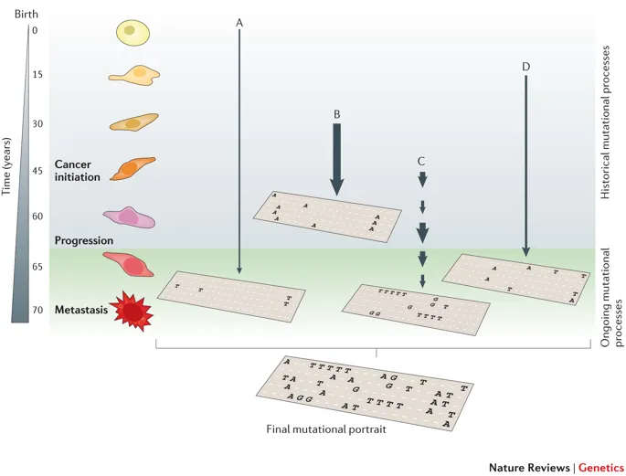

# (PART\*) Part I: Background and Prerequisite {-}

# Mutational signatures {#mutsig-intro}

"*Underlying cancer hallmarks are genome instability, which generates the genetic diversity that expedites their acquisition, and inflammation, which fosters multiple hallmark functions*" [@hanahanHallmarksCancerNext2011]. Cancer genomes typically harbors more than 1,000 somatic mutations in small (e.g., point mutations, short insertions and deletions) and large scale (e.g., copy number variations, rearrangements). DNA contexts where mutation may accumulate in response to both endogenous processes and exogeneous exposures [@alexandrov2013signatures]. In recent years, computational approaches including [*non-negative matrix factorization* (NMF)](https://en.wikipedia.org/wiki/Non-negative_matrix_factorization) have been applied to the mutation catalog of human/mouse tumors to detect characteristic DNA mutational patterns [@alexandrov2013signatures;@alexandrov2020repertoire;@wang2021copy], also known as **"mutational signatures"**.


## Biological significance of mutational signature

To better illustrate the biological significance of mutational signatures, we show some
well organized figures here.

```{r echo=FALSE, fig.cap="The illustration of SBS signature, fig source: https://www.nature.com/articles/nrg3729", out.width="80%", fig.width=10}

```

```{r echo=FALSE, fig.cap="The illustration of SBS signature (2), fig source: https://www.nature.com/articles/s41467-018-05228-y"}
knitr::include_graphics("fig/sbs_signature_overview.png")
```

### COSMIC signatures

SBS (single base substitution, or SNV) signature is a famous and well-established type of mutational signature. SBS signatures are well studied and related to single-strand changes, typically caused by defective DNA repair.
Common etiologies contain aging, defective DNA mismatch repair, smoking, ultraviolet light exposure and [APOBEC family members](https://en.wikipedia.org/wiki/APOBEC).

Currently, all SBS signatures are summarized in COSMIC database, it has two versions: [v2](https://cancer.sanger.ac.uk/cosmic/signatures_v2) and [v3](https://cancer.sanger.ac.uk/cosmic/signatures/SBS/).

Recently, @alexandrov2020repertoire extends the concept of mutational signature to three types of alteration: SBS, DBS (short for doublet base substitution) and INDEL (short for short insertion and deletion).
All reported common signatures are recorded in COSMIC (https://cancer.sanger.ac.uk/cosmic/signatures/), so we usually call them **COSMIC signatures**.

### Copy number signatures

Unlike several mutation types presented in current COSMIC database for generating mutational signatures, it is hard to represent copy number features and generate the matrix for NMF decomposition.

@macintyre2018copy created a new method to generate the matrix for extracting signature by NMF algorithm. The steps are:

- derive 6 copy number features from absolute copy number profile
- apply mixture modeling to breakdown each feature distribution into mixtures of Gaussian or mixtures of Poisson distributions
- generate a sample-by-component matrix representing the sum of posterior probabilities of each copy-number event being assigned to each component.

Based on the work, we devised a new method which discards the statistical modeling and create a fixed number of predefined components from 8 copy number features to generate the matrix as the input of NMF [@wang2021copy],
it is easier to reproduce the result, apply to different cancer types and compare results.
To test if the method would works, we applied it to prostate cancer and successfully identified 5 copy number signatures [@wang2021copy].


```{r echo=FALSE, fig.cap="The illustration of copy number signatures, fig source: https://www.nature.com/articles/s41588-018-0212-y"}
knitr::include_graphics("fig/cn_signature_overview.png")
```

Currently, there are few studies focus on copy number signatures and no reference signature database for matching and explaining the etiologies (The signatures presented in two papers above can be used as references). If you study them, you should do extra work to explore and validate them. Furthermore, the input absolute copy number data may be generated by different methods and platforms, it is normal that the contribution of some copy number feature components varies a little and result in relatively lower signature similarity when comparing different cohorts or different copy number profile generation methods.

In addition, Alexandrov team adopted a similar approach for generating signatures like current COSMIC signatures
and described them in ~10,000 human tumors [@steele2021signatures]. Many interesting results have been reported and this
would be a standard approach for allele-specific copy number profile.

### Genome rearrangement signatures

Genome rearrangement signatures (RS) also used COSMIC signature like approach to generation
rearrangement classes in each tumor sample.
RS are limited to whole genome sequencing data and also less studied.
RS has been successfully applied to 560 breast tumor WGS data [@nik2016landscape] and linked to clinical
outcomes in high grade serous ovarian cancers [@hillman2018genomic].

### More information

More information about mutational signatures you can read [this wiki page](https://en.wikipedia.org/wiki/Mutational_signatures)
and [COSMIC signature data page](https://cancer.sanger.ac.uk/signatures/).
