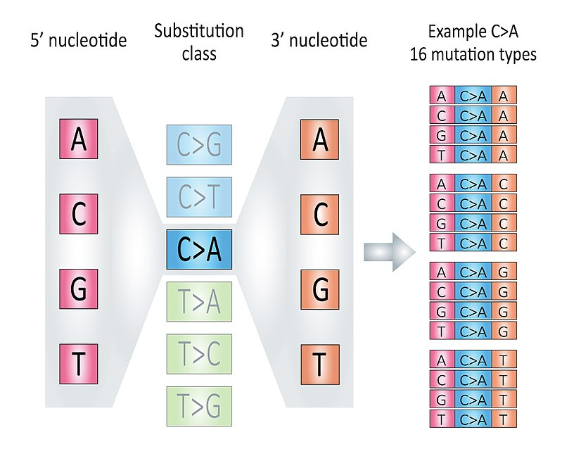

# (PART\*) Part II: Workflows {-}

# Mutational signature analysis basics {#basic-workflow}

This chapter demonstrates how to run two key mutational signature analyses (*de novo* signature
discovery and signature fitting) in details.
More specifically, we will introduce how to identify COSMIC signatures from records of variant calling data.
The COSMIC signatures include three type of signatures: SBS, DBS and ID (short for INDEL). For other signature type, please read chapter \@ref(analysis-supps).

The signature identification procedure has been divided into 3 steps:

1. Read mutation data.
2. Tally components: for SBS, it means classifying SBS records into 96 components (the most common case) and generating sample matrix by counting component in each sample.
3. *de novo* extract signatures or quantify signature activity by fitting observed
data to reference signature.
  - For *de novo* signature discovery, there are manual approach and automatic approach. When you choose manual approach, you should estimate signature number and then extract specified number of signatures.

## Data input

The input data should be in [VCF](https://www.ebi.ac.uk/training-beta/online/courses/human-genetic-variation-introduction/variant-identification-and-analysis/understanding-vcf-format/), [MAF](https://docs.gdc.cancer.gov/Data/File_Formats/MAF_Format/) format.

- For VCF, it can only be VCF file paths.
- For MAF, it can be either a MAF file or a `data.frame`. 

MAF format is the standard way to represent small-scale variants in **sigminer**. There is a popular R/Bioconductor package [**maftools**](https://github.com/PoisonAlien/maftools) [@mayakonda2018maftools] for analyzing MAF data. It provides an R class **MAF** to represent MAF format data.

### VCF as input

If you use VCF files as input, you can use `read_vcf()` to read multiple VCF files as a `MAF` object.

```{r message=TRUE}
library(sigminer)

vcfs <- list.files(system.file("extdata", package = "sigminer"), "*.vcf", full.names = TRUE)
maf <- read_vcf(vcfs)
maf <- read_vcf(vcfs, keep_only_pass = FALSE)
```

### MAF as input

MAF format is the most recommended input, you can provide it either as a file or as a `data.frame`.

Typically, you can obtain the data in the following ways:

1. You get multiple VCF files and convert them into a MAF file ([vcf2maf](https://github.com/mskcc/vcf2maf) is the most used tool for conversion).
2. You get a MAF file from a reference or a public data portal, e.g., [cBioPortal](http://www.cbioportal.org/) or [GDC portal](https://portal.gdc.cancer.gov/).
3. You get a EXCEL file providing MAF-like data from a reference, you should read the data firstly (with `readxl::read_excel()`) and then construct a `data.frame` providing necessary columns.

Once a MAF file or a MAF-like `data.frame` is ready, you can read/convert it as a `MAF` object with `read_maf()`. Here TCGA LAML dataset is used as an example:

```{r}
laml.maf <- system.file("extdata", "tcga_laml.maf.gz", package = "maftools", mustWork = TRUE)
laml <- read_maf(maf = laml.maf)
laml
```

The `laml` is a `MAF` object. The `MAF` class is exported from **maftools** to **sigminer**. So `laml` can be directly use functions provided by **maftools**. 

As a `MAF` object, the mutation records are stored in slot `data` and `maf.silent`.

```{r}
head(laml@data)
head(laml@maf.silent)
```

The `data` slot contains non-silent variants, and the `maf.silent` slot contains silent variants.
Default uses "Variant Classifications" with high/moderate variant consequences as non-silent variants. <http://asia.ensembl.org/Help/Glossary?id=535>: "Frame_Shift_Del", "Frame_Shift_Ins", "Splice_Site", "Translation_Start_Site","Nonsense_Mutation", "Nonstop_Mutation", "In_Frame_Del","In_Frame_Ins", "Missense_Mutation" (see `?read_maf`). If you want to change, please set `vc_nonSyn` option.


Other slots in `MAF` object are summary data either by sample or gene/variant type etc.

```{r}
slotNames(laml)
```
Acute myeloid leukemia is not a good object to study mutational signatures due to low mutation burden, we will use a subset of TCGA breast cohort as for illustration of the following analyses.

Anand Mayakonda has already stored whole TCGA mutation data as MAF objects in [**TCGAmutations**](https://github.com/PoisonAlien/TCGAmutations) package.
Here I will load the TCGA BRCA cohort and create a sub-cohort with 100 tumors.

```{r, eval=FALSE}
library(maftools)
tcgaAvailable()
```

```{r, eval=FALSE}
set.seed(1234)
#brca <- readRDS("data/BRCA.RDs")
brca <- tcga_load("BRCA")
brca <- subsetMaf(brca,
                  tsb = as.character(sample(brca@variants.per.sample$Tumor_Sample_Barcode, 100)))
saveRDS(brca, file = "data/brca.rds")
```

> Here we save this cohort so no need to download the dataset every time.

```{r}
brca <- readRDS("data/brca.rds")
```

For CNV and genome rearrangement records, check chapter \@ref(analysis-supps).

## Tally components 

### The most common 96 components

According to 3-nucleotide context (mutated base, 5' and 3' adjacent bases) and base complementary pairing principle, we can divide all SBS mutations into 96 mutation types. We call each mutation type as a *component* here.

> This classification is based the six substitution subtypes: C>A, C>G, C>T, T>A, T>C, and T>G (all substitutions are referred to by the pyrimidine of the mutated Watson—Crick base pair). Further, each of the substitutions is examined by incorporating information on the bases immediately 5’ and 3’ to each mutated base generating 96 possible mutation types (6 types of substitution x 4 types of 5’ base x 4 types of 3’ base). 

```{r echo=FALSE, fig.cap="The illustration of 96 components, fig source: https://en.wikipedia.org/wiki/Mutational_signatures"}

```

We tally components in each sample, and generate a sample-by-component matrix.

```{r}
mt_tally <- sig_tally(
  brca,
  ref_genome = "BSgenome.Hsapiens.UCSC.hg19",
  use_syn = TRUE
)
```

> Here set `use_syn = TRUE` to include all variant records in MAF object to generate sample matrix.

```{r}
mt_tally$nmf_matrix[1:5, 1:5]
```

We use notion `left[ref>mut]right` to mark each component, e.g. `C[T>G]A` means a base T with 5' adjacent base C and 3' adjacent base A is mutated to base G.


### Other Situations

Above we show the most common SBS classifications, there are other situations supported by **sigminer**, including other classifications for SBS records and other mutation types (DBS and ID). All situations about SBS, DBS and ID signatures are well documented in [wiki of **SigProfilerMatrixGenerator** package](https://osf.io/s93d5/wiki/home/).

#### Other SBS classifications

After calling `sig_tally()`, the most used matrix is stored in `nmf_matrix`, and all matrices generated by **sigminer** are stored in `all_matrices`.

```{r}
str(mt_tally$all_matrices, max.level = 1)
```

If you add the strand classification, all matrices can be generated by **sigminer** will return.

```{r}
mt_tally2 <- sig_tally(
  brca,
  ref_genome = "BSgenome.Hsapiens.UCSC.hg19",
  use_syn = TRUE, add_trans_bias = TRUE
)
str(mt_tally2$all_matrices, max.level = 1)
```

#### DBS and ID components

If you want to generate DBS or ID matrices, just modify the `mode` option.

```{r}
mt_tally_DBS <- sig_tally(
  brca,
  ref_genome = "BSgenome.Hsapiens.UCSC.hg19",
  use_syn = TRUE, 
  mode = "DBS",
  add_trans_bias = TRUE
)
str(mt_tally_DBS$all_matrices, max.level = 1)
```

> Program will stop if no records to analyze.
Let's see ID records.

```{r}
mt_tally_ID <- sig_tally(
  brca,
  ref_genome = "BSgenome.Hsapiens.UCSC.hg19",
  use_syn = TRUE, 
  mode = "ID",
  add_trans_bias = TRUE
)
str(mt_tally_ID$all_matrices, max.level = 1)
```

#### Take togother

If you want to get all matrices for SBS, DBS and ID at the same time, you don't need to write a `for` loop or type three times to do this.
Just set `mode='ALL'`, **sigminer** will do it for you!

```{r}
mt_tally_all <- sig_tally(
  brca,
  ref_genome = "BSgenome.Hsapiens.UCSC.hg19",
  use_syn = TRUE, 
  mode = "ALL",
  add_trans_bias = TRUE
)
str(mt_tally_all, max.level = 1)
```

Please note, in this case, just a list containing matrices will return.

## *de novo* signature discovery

**Sigminer** provides many approaches to extract mutational signatures. To test their performances, We use 4 mutation catalog datasets (each mutation catalog dataset is composed of 30 samples, 10 COSMIC v2 (SBS) signatures are randomly assigned to each sample with random signature exposure/activity) from @degasperi2020practical. The following table shows how many signatures can be recovered and the corresponding average cosine similarity to COSMIC reference signatures for each approach with settings.

| Approach      | Selection Way        | Setting                                               | Caller                        | Recommend | Driver          | Set1       | Set2       | Set3            | Set4       | Success /Mean | Run time          | Note                                                                                                                                                                |
|:--------------|:---------------------|:------------------------------------------------------|:------------------------------|:----------|:----------------|:-----------|:-----------|:----------------|:-----------|:--------------|:------------------|---------------------------------------------------------------------------------------------------------------------------------------------------------------------|
| Standard NMF  | Manual               | Default. 50 runs (estimation) + 100 runs (extraction) | `sig_estimate`, `sig_extract` | YES ⭐⭐⭐   | R               | 10 (0.884) | 10 (0.944) | 9 or 10 (0.998) | 10 (0.994) | \~90%/0.955   | \~1min (8 cores)  | This is a basic method, suitable for good mutation data with enough mutations. |
| SigProfiler   | **Manual/Automatic** | Default. 100 runs                                     | `sigprofiler_extract`         | YES ⭐⭐⭐⭐  | Python/Anaconda | 10 (0.961) | 10 (0.999) | 10 (0.990)      | 10 (0.997) | 100%/0.987    | \~1h (8 cores)    | A golden standard like approach in this field, but longer run time, and the requirement for Python environment and extra large packages reduce its popularity here. |
| Best Practice | **Manual/Automatic** | Use bootstrapped catalog (1000 runs)                  | `bp_extract_signatures`       | YES ⭐⭐⭐⭐⭐ | R               | 10 (0.973) | 10 (0.990) | 10 (0.992)      | 10 (0.971) | 100%/0.981    | \~10min (8 cores) | My R implementation for methods from reference \#5 and \#6. Should be the best option here. (**Pay attention to the suggested solution**) |
| Best Practice | **Manual/Automatic** | Use original catalog (1000 runs)                      | `bp_extract_signatures`       | NO :star: | R               | 10 (0.987) | 9 (0.985)  | 10 (0.997)      | 9 (0.987)  | 50%/0.989     | \~10min (8 cores) | This is created to compare with the approach with bootstrapped catalogs above and the standard NMF way. |
| Bayesian NMF  | **Automatic**        | L1KL+optimal (20 runs)                                | `sig_auto_extract`            | YES ⭐⭐⭐   | R               | 10 (0.994) | 9 (0.997)  | 9 (0.998)       | 9 (0.999)  | 25%/0.997     | \~10min (8 cores) | The Bayesian NMF approach auto reduce the signature number to a proper value from a initial signature number, here is 20. |
| Bayesian NMF  | **Automatic**        | L1KL+stable (20 runs)                                 | `sig_auto_extract`            | YES ⭐⭐⭐⭐  | R               | 10 (0.994) | 9 (0.997)  | 10 (0.988)      | 9 (0.999)  | 50%/0.995     | \~10min (8 cores) | See above. |
| Bayesian NMF  | **Automatic**        | L2KL+optimal (20 runs)                                | `sig_auto_extract`            | NO :star: | R               | 12 (0.990) | 13 (0.988) | 12 (0.902)      | 12 (0.994) | 0%/0.969      | \~10min (8 cores) | See above. |
| Bayesian NMF  | **Automatic**        | L2KL+stable (20 runs)                                 | `sig_auto_extract`            | NO :star: | R               | 12 (0.990) | 12 (0.988) | 12 (0.902)      | 12 (0.994) | 0%/0.969      | \~10min (8 cores) | See above. |
| Bayesian NMF  | **Automatic**        | L1WL2H+optimal (20 runs)                              | `sig_auto_extract`            | YES ⭐⭐⭐   | R               | 9 (0.989)  | 9 (0.999)  | 9 (0.996)       | 9 (1.000)  | 0%/0.996      | \~10min (8 cores) | See above. |
| Bayesian NMF  | **Automatic**        | L1WL2H+stable (20 runs)                               | `sig_auto_extract`            | YES ⭐⭐⭐⭐  | R               | 9 (0.989)  | 9 (0.999)  | 9 (0.996)       | 9 (1.000)  | 0%/0.996      | \~10min (8 cores) | See above. |

> NOTE: although Bayesian NMF approach with L1KL or L1WL2H prior cannot recover all 10 signatures here, but it is close to the true answer from initial signature number 20 in a automatic way, and the result signatures are highly similar to reference signatures. This also reminds us that we could not use this method to find signatures with small contributions in tumors.

From **sigminer** v2.1.0, an unified interface `sig_unify_extract()`. has been implemented to access the
4 signature extraction approaches.

```{r message=TRUE}
args(sig_unify_extract)
```
Once you determine a method, please read all parameters shown in the detail function.

- "bayes_nmf" corresponds to `sig_auto_extract()`.
- "repeated_nmf" corresponds to `sig_extract()`.
- "bootstrap_nmf" coresponds to `bp_extract_signatures()`.
- "sigprofiler" corresponds to `sigprofiler_extract()`.

Note, when you use `sig_extract()` ("repeated_nmf") and you don't know how
to select the signature number, you should run `sig_estimate()` firstly.

### Manual signature estimation and extraction

For example, let's try signature number 2-6. For simplicity, we just run NMF 10 times for each signature number. We use 4 cores to speed up the computation.

```{r, eval=FALSE}
mt_est <- sig_estimate(mt_tally$nmf_matrix,
                       range = 2:6,
                       nrun = 10, # increase this value if you wana a more stable estimation
                       use_random = FALSE,  # if TRUE, add results from randomized input
                       cores = 4,
                       verbose = TRUE)
```

```{r, include=FALSE}
load("data/mt_est.RData")
```

We can show signature number survey for different measures by `show_sig_number_survey2()`.

```{r}
## You can also select the measures to show
## by 'what' option
show_sig_number_survey2(mt_est$survey)
```

> For the details of all the measures above, please read @gaujoux2010flexible and [vignette](https://cran.r-project.org/web/packages/NMF/vignettes/) of R package **NMF**.
The measures either provide stability (`cophenetic`) or how well can be reconstructed (`rss`).

Typically, measure **cophenetic** is used for determining the signature number. We can easily generate an elbow plot
with function `show_sig_number_survey()`.

```{r}
show_sig_number_survey(mt_est$survey, right_y = NULL)
```

> The most common approach is to use the cophenetic correlation coefficient. Brunet et al. suggested choosing the smallest value of r for which this coefficient starts decreasing. [@gaujoux2010flexible]
Cophenetic value (range from 0-1) indicates the robustness of consensus matrix clustering. In this situation, 3 is good. However, we can found that the cophenetic values are all >=0.9 from 2 to 5. So the more suitable way is considering both stability and reconstruction error at the same time, it can be easily done by `show_sig_number_survey()`.

```{r}
show_sig_number_survey(mt_est$survey)
```

> This function is very flexible, you can pick up any measure to the left/right axis. However, the default setting is the most recommended way.
We can see that we get a minimal RSS in signature number, and when this value goes from 5 to 6, the RSS increase! So we should not choose signature number more than 5 here because 6 is overfitting.

**NOTE**: There are no gold standard to determine the signature number. Sometimes, you should consider multiple measures. Remember, the most important thing is that **you should have a good biological explanation for each signature**.
The best solution in study may not be the best solution in math.

Now that the 5 signatures should be a stable solution, next we can extract it with
more runs to obtain the optimal result. In general, use 30~50 NMF runs will get a robust result. 

```{r, eval=FALSE}
mt_sig <- sig_extract(mt_tally$nmf_matrix, 
                      n_sig = 5,
                      nrun = 30,
                      cores = 4)
```

```{r, include=FALSE}
load("data/mt_sig.RData")
```

### Automatic extraction

If you have no idea to select an optimal signature number from procedures above, you can try auto-extraction approaches provided by **sigminer**.

The latest version of **sigminer** provides three ways to auto-extract mutational signatures.

1. Auto-extract signatures by automatic relevance determination technique in non-negative matrix factorization [@tan2012automatic], the code is implemented by **SignatureAnalyzer** [@kim2016somatic] and exported to **sigminer**. This approach is known as bayesian NMF and the default approach in `sig_unify_extract()`.
2. Auto-extract signatures by [SigProfiler](https://github.com/AlexandrovLab/SigProfilerExtractor), the gold-standard tool used for identifying signatures cataloged in COSMIC database. The technical details please read @alexandrov2020repertoire.
3. Multiple NMF runs with bootstrapped mutation catalogs. This method is adopted from @degasperi2020practical.

#### Method 1: Bayesian NMF

In this approach, you need to set a maximum signature number (default is `25`) and run times to get the result. 10 for `nrun` here is okay, and more than 100 is not recommended.
The Bayesian NMF will starts from a larger signature number and reduce it to a proper signature number to maximize posterior probability.

```{r, eval=FALSE}
mt_sig2 <- sig_unify_extract(mt_tally$nmf_matrix, range = 10, nrun = 10)
```

This is same as:

```{r, eval=FALSE}
mt_sig2 <- sig_auto_extract(mt_tally$nmf_matrix,
                            K0 = 10, nrun = 10,
                            strategy = "stable")
```


```{r, include=FALSE}
load("data/mt_sig2.RData")
```

Here the program uses **'robust' strategy** to return the result (see `strategy` option). It means that if you run 10 times and 6 of them return `4` signatures, then the optimal result with `4` signatures will be returned.

The info of each run can be given as:

```{r}
knitr::kable(mt_sig2$Raw$summary_run)
```

The `mt_sig2` has similar structure as `mut_sig`.

#### Method 2: SigProfiler

**Sigminer** provides two functions `sigprofiler_extract()` and `sigprofiler_import()` to install, use SigProfiler and import [**SigProfilerExtractor**](https://github.com/AlexandrovLab/SigProfilerExtractor) results into R as a `Signature` object like other extraction methods mentioned above.

An (not running) example is given below (see `?sigprofiler` for more info).

```{r, eval=FALSE}
reticulate::conda_list()
sigprofiler_extract(cn_tally_W$nmf_matrix, "~/test/test_sigminer",
                    use_conda = TRUE
)

# Same as
# sig_unify_extract(mt_tally$nmf_matrix, use_conda = FALSE, py_path = "/Users/wsx/anaconda3/bin/python", approach = "sigprofiler", out = "~/test/test_sigminer")
sigprofiler_extract(mt_tally$nmf_matrix, "~/test/test_sigminer",
                    use_conda = FALSE, py_path = "/Users/wsx/anaconda3/bin/python"
)
```

#### Method 3: bootstrapped NMF

```{r eval=FALSE}
# Same as
# mt_sig3 <- sig_unify_extract(
#   cn_tally_W$nmf_matrix,
#   range = 3:8,
#   nrun = 10
#   n_bootstrap = 5
# )

mt_sig3 <- bp_extract_signatures(
  cn_tally_W$nmf_matrix,
  range = 3:8,
  n_bootstrap = 5,
  n_nmf_run = 10
)
```

## Match Signatures  

After extracting signatures, we need to know their etiologies. This can be done by comparing the identified signatures and reference signatures from COSMIC database.

```{r}
sim <- get_sig_similarity(mt_sig2)
```

The result object `sim` is a list.

```{r}
str(sim)
```

From the result we can see that three signatures are properly matched to COSMIC reference signatures. If you find unknown signatures in your study, you should explore the etiologies by other analyses and even experiments.

The similarity matrix can be plotted.

```{r}
pheatmap::pheatmap(sim$similarity)
```

You can also try the COSMIC signature database V3 with:

```{r}
sim_v3 <- get_sig_similarity(mt_sig2, sig_db = "SBS")
```


## Reference signature fitting

Besides *de novo* signature discovery shown in previous chapters, another common task is that
you have gotten some reference signatures (either from known database like COSMIC or *de novo* discovery step), you want to know how these signatures contribute (fit) in a sample. That's the target of `sig_fit()`.

`sig_fit()` uses multiple methods to compute exposure of pre-defined signatures from the spectrum of a (can be more) sample. Use `?sig_fit` see more detail.

To show how this function works, we use a sample with maximum mutation counts as example data.

```{r}
i <- which.max(apply(mt_tally$nmf_matrix, 1, sum))
example_mat <- mt_tally$nmf_matrix[i, , drop = FALSE] %>% t()
```

```{r}
head(example_mat)
```


### Fit signatures from reference signature databasase

For SBS signatures, users may want to directly use reference signatures from COSMIC database.

```{r}
sig_fit(example_mat, sig_index = 1:30)
```

> At default, COSMIC v2 signature database with 30 reference signatures is used (i.e. `sig_db = "legacy"`). Set `sig_db = "SBS"` for COSMIC v3 signature database.
That's it!

You can set `type = "relative"` for getting relative exposure.

```{r}
sig_fit(example_mat, sig_index = 1:30, type = "relative")
```


For multiple samples, you can return a `data.table`, it can be easier to integrate with other information in R.

```{r}
sig_fit(t(mt_tally$nmf_matrix[1:5, ]), sig_index = 1:30, return_class = "data.table", rel_threshold = 0.05)
```

When you set multiple signatures, we recommend setting `rel_threshold` option, which will set exposure of a signature to `0` if its relative exposure in a sample less than the `rel_threshold`.

### Fit custom signatures

We have already determined the SBS signatures before. Here we can set them to `sig` option.

```{r}
sig_fit(example_mat, sig = mt_sig2)
```

### Performance comparison

Now that we can use `sig_fit` for getting optimal exposures, we can compare the RSS between **raw matrix** and the **reconstructed matrix** either by NMF and `sig_fit()`.


i.e. 

$$
RSS = \sum(\hat H - H)^2
$$

```{r}
## Exposure got from NMF
sum((apply(mt_sig2$Signature, 2, function(x) x/sum(x)) %*% mt_sig2$Exposure - t(mt_tally$nmf_matrix))^2)
```

```{r}
## Exposure optimized by sig_fit
H_estimate = apply(mt_sig2$Signature, 2, function(x) x/sum(x)) %*% sig_fit(t(mt_tally$nmf_matrix), sig = mt_sig2)
H_estimate = apply(H_estimate, 2, function(x) ifelse(is.nan(x), 0, x))
H_real = t(mt_tally$nmf_matrix)
sum((H_estimate - H_real)^2)
```


### Estimate exposure/activity stability by bootstrapping

This feature is based on `sig_fit()`, it uses the resampling data of original input and runs `sig_fit()` multiple times to estimate the exposure. Bootstrapped replicates >= 100 is recommended, here I just use 10 times for illustration.

```{r}
bt_result <- sig_fit_bootstrap_batch(example_mat, sig = mt_sig2, n = 10)
bt_result
```

You can plot the result very easily with functions provided by **sigminer**.

```{r}
show_sig_bootstrap_exposure(bt_result, sample = "TCGA-A8-A09G-01A-21W-A019-09")
```

```{r}
show_sig_bootstrap_error(bt_result, sample = "TCGA-A8-A09G-01A-21W-A019-09")
```

```{r}
show_sig_bootstrap_stability(bt_result)
```

P values have been calculated under specified relative exposure cutoff (0.05 at default).


# Other signature types {#analysis-supps}

## Copy number signature (*Wang* et al)

### Read data 

The input requires absolute copy number profile with following information:

- Segment chromosome.
- Segment start.
- Segment end.
- **Absolute copy number value for this segment**: must be integer.
- Sample ID.

The input data can be result from any software which provides information above.

Useful softwares are listed below:

- [ABSOLUTE](https://software.broadinstitute.org/cancer/cga/absolute).
- [Sequenza](https://cran.r-project.org/web/packages/sequenza/index.html)
- [FACETS](https://github.com/mskcc/facets)
- [PennCNV](http://penncnv.openbioinformatics.org/en/latest/) & [ASCAT](https://www.crick.ac.uk/research/labs/peter-van-loo/software)
- [CNVkit](https://github.com/etal/cnvkit)

Useful analysis reference:

- [Prostate Cancer Variation Signature Analysis Report](https://xsliulab.github.io/PC_CNA_signature/)

The import work is done by `read_copynumber()`, which supports `data.frame` or file, and even result directory from **ABSOLUTE**.

Option `sigminer.sex` is used to control the processing of sex. If you don't care the sex chromosomes (i.e. X and Y),
you can ignore this setting after removing the X/Y segments, otherwise the `summary` in the result `cn` and tally process may be biased.

```{r}
## Default is "female"
## You can ignore the setting if all samples are females
## But we recommend you set it
options(sigminer.sex = "male")
## For cohort contains both males and females,
## set a data.frame with two columns, i.e.
## options(sigminer.sex = sex_df),
## which
## sex_df = data.frame(sample = c("sample1", "sample2",
##                     sex = "female", "male"))
# Load toy dataset of absolute copynumber profile
load(system.file("extdata", "toy_segTab.RData",
  package = "sigminer", mustWork = TRUE
))
cn <- read_copynumber(segTabs,
  seg_cols = c("chromosome", "start", "end", "segVal"),
  genome_build = "hg19", complement = FALSE, verbose = TRUE
)
cn
```

> Currently, you can refer to `extract_facets_cnv()` and `extract_seqz_cnv()` in <https://github.com/ShixiangWang/prad_signature/blob/master/analysis/src/99-functions.R> to
> see how to get tidy data from a result directory of FACETS or Sequenza.
## Tally Components 

Currently, there are two methods for generating sample-by-component matrix.

Option `sigminer.copynumber.max` is used to control the processing of max copy number values. Run `?sig_tally` to see more.

```{r, eval=FALSE}
## Even you set max_copynumber = 20 in read_copynumber(),
## the segmental copy number may be greater than 20
## because for male samples, the X/Y segmental copy number
## values will be doubled in tally process.
## This setting will make copy number values of all segments
## not greater than 20.
options(sigminer.copynumber.max = 20)
# Load copy number object
load(system.file("extdata", "toy_copynumber.RData",
  package = "sigminer", mustWork = TRUE
))
# Use method designed by Wang, Shixiang et al.
cn_tally_W <- sig_tally(cn, method = "W")
```

> You can set `options(sigminer.sex = "male", sigminer.copynumber.max = 20)` at the top of your code
> to avoid setting them in two places.
>
> **Of note**, the `sigminer.copynumber.max` option only has effect on `sig_tally()` with method "W",
> the `sigminer.sex` option has effects on `read_copynumber()` and `sig_tally()` with method "W".

```{r, include=FALSE}
load(system.file("extdata", "toy_copynumber_tally_W.RData",
  package = "sigminer", mustWork = TRUE
))
```

This step return a `list` containing information about copy number features, components and matrix for NMF etc.

### Extract signatures 

When you get the matrix, you can just do the signature extraction as SBS etc. signatures. So here we won't talk much.

```{r}
cn_tally_W$nmf_matrix[1:5, 1:5]
```


```{r, eval=FALSE}
# library(NMF)
sig_w = sig_extract(cn_tally_W$nmf_matrix, n_sig = 2)
```

```{r, include=FALSE}
load("data/sig_w.RData")
```

## Allele specific copy number signature (*Steele* et al)

Previously described steps can be also applied to allele specific copy number
profile with *Steele* et al approach. There are two catalog methods provided by
*Steele* et al: 40 catalogs and 48 catalogs. In current stage, 48 catalog is
recommended as ~20 reference signatures have been built on ~10,000 TCGA tumors. 
reference example is given below:

```{r}
# Generate example data
load(system.file("extdata", "toy_segTab.RData",
                 package = "sigminer", mustWork = TRUE
))
set.seed(1234)
# Make sure minor_cn is provided
segTabs$minor_cn <- sample(c(0, 1), size = nrow(segTabs), replace = TRUE)
cn2 <- read_copynumber(segTabs,
                       seg_cols = c("chromosome", "start", "end", "segVal"),
                       genome_measure = "wg", complement = TRUE, add_loh = TRUE
)

# Use tally method "S" (Steele et al.)
tally_s2 <- sig_tally(cn2, method = "S")

cn_sig2 = sig_extract(tally_s2$all_matrices$CN_48, n_sig = 2)
get_sig_similarity(cn_sig2, sig_db = "CNS_TCGA")
```

## Rearrangement signature

Similarity, once you know how to generate matrix for genome rearrangement signature,
you can easily apply the signature extraction or signature fitting.

```{r}
sv <- readRDS(system.file("extdata", "toy_sv.rds", package = "sigminer", mustWork = TRUE))
rs <- read_sv_as_rs(sv)
# svclass is optional
rs2 <- read_sv_as_rs(sv[, setdiff(colnames(sv), "svclass")])
identical(rs, rs2)

tally_rs <- sig_tally(rs)
str(tally_rs)
```


# Target visualization  {#target-vis}

## `CopyNumber` object

### Profile 

```{r}
show_cn_profile(cn, nrow = 2, ncol = 1)
```

```{r}
show_cn_circos(cn, samples = 1)
```

### Distribution 

```{r}
show_cn_distribution(cn, mode = "ld")
```


```{r}
show_cn_distribution(cn, mode = "cd")
```

## `Signature` object

`Signature` is a core object in **sigminer**, it stores signatures and their exposures. Here we show how to plot signature profile and exposure profile. The result plots are basically **ggplot** based, so they can be further edited by your custom operations with **ggplot** grammar.

### Operate `Signature` 

The result of `sig_extract()` or `sig_auto_extract()` is a `list` with `Signature` class. You can use `$` or use operation function to obtain the data stored in it.

To get the signature matrix:

```{r}
# Or mt_sig2$Signature
sig_signature(mt_sig2)[1:5, ]
```

To get signature exposure matrix:

```{r}
# Or mt_sig$Exposure
sig_exposure(mt_sig2)[, 1:5]
```

`get_sig_exposure()` may be more useful, it can be used to return a `data.frame` and set an exposure threshold.


```{r}
get_sig_exposure(mt_sig2)
```

### Signature profile 

A signature is composed of distinct component patterns. They can be shown by `show_sig_profile()`. Of note, for different types of signature, the bar heights may have different meanings.

- SBS signatures are displayed based on the observed component frequency of the human genome, i.e., representing the relative proportions of mutations generated by each signature based on the actual trinucleotide frequencies of the reference human genome.
- Similar to SBS signatures, copy number signatures are displayed based on the observed component frequency of the human genome. Of note, considering the count process of each feature is relatively independent, the profile is row normalized by each feature, unlike Macintyre et al. (2018) did column normalization (this method is easy to mislead readers), so the bar height can be compared within/between features.

### SBS signature profile

```{r, fig.width=12}
show_sig_profile(mt_sig, mode = "SBS", paint_axis_text = FALSE, x_label_angle = 90)
```


```{r, fig.width=12}
show_sig_profile(mt_sig, mode = "SBS", style = "cosmic", x_label_angle = 90)
```

### Copy number signature profile

For copy number signatures from tally method "W", you have to specify the `normalize` option as "feature", so  the bar heights can be more clearly compared.

```{r, fig.width=12}
show_sig_profile(sig_w,
                 mode = "copynumber",
                 normalize = "feature",
                 method = "W",
                 style = "cosmic")
```

### COSMIC signature profile

Users can show profile of COSMIC signatures by `show_cosmic_sig_profile()`.

To see valid signature numbers, run

```{r}
show_cosmic_sig_profile(sig_db = "legacy")
```

> 'legacy' is for COSMIC v2.

```{r}
show_cosmic_sig_profile(sig_db = "SBS")
```

To show the plot, specify signature shortnames to `sig_index` option.

```{r, fig.width=12}
show_cosmic_sig_profile(sig_index = c(1, 5, 6), style = "cosmic")
```


```{r, fig.width=12}
show_cosmic_sig_profile(sig_index = c(1, 2, 3), style = "cosmic", sig_db = "DBS")
```


```{r, fig.width=12}
show_cosmic_sig_profile(sig_index = c(4, 5, 6), style = "cosmic", sig_db = "ID")
```

### Exposure (activity) profile 

```{r, fig.width=12}
show_sig_exposure(mt_sig)
```

```{r, fig.width=12}
show_sig_exposure(mt_sig, style = "cosmic")
```


```{r, fig.width=12}
show_sig_exposure(sig_w, style = "cosmic")
```

You can put group labels in the exposure profile.

```{r}
grp <- get_groups(sig_w)
grp_label <- grp$group
names(grp_label) <- grp$sample
```

```{r, fig.width=12}
show_sig_exposure(sig_w, style = "cosmic", groups = grp_label)
```

Of note:

- For COSMIC signatures, the absolute exposure is the estimated mutation counts.
- For copy number signatures, the absolute exposure is the estimated copy number segments.

### Consensus map  

This can only support the result from `sig_extract()` with multiple runs. 

```{r}
show_sig_consensusmap(mt_sig)
```


### Catalogue profile

Based on plot method for signature, we can plot raw catalog profile.

```{r, fig.width=12, fig.height=2.5}
show_catalogue(t(mt_tally$nmf_matrix), style = "cosmic", x_label_angle = 90)
```

At default, the function sums all samples. Users can specify sample ID.


```{r, fig.width=12, fig.height=2.5}
show_catalogue(t(mt_tally$nmf_matrix), style = "cosmic", samples = "TCGA-E9-A22E-01A-11D-A159-09", x_label_angle = 90)
```
